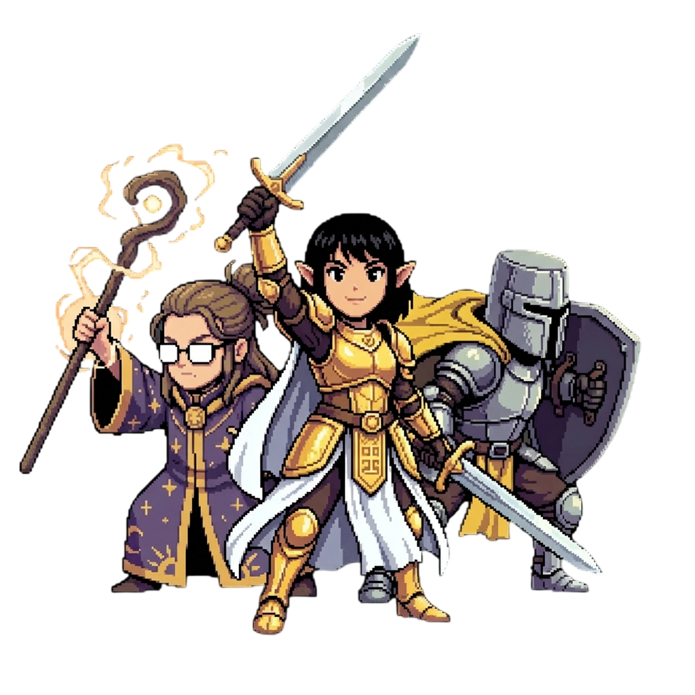
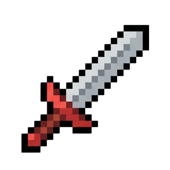
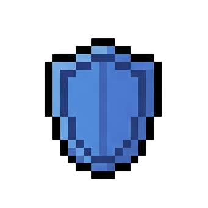
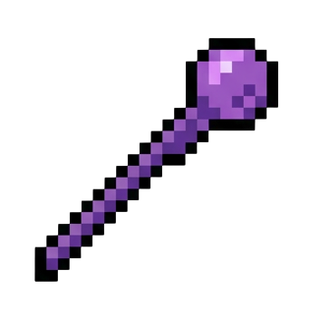
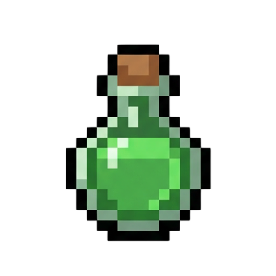
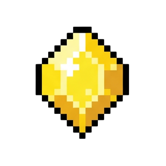
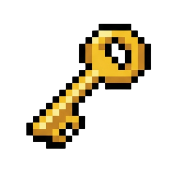

# Dungeon Match Heroes

## ⚔️ The Tale of the Three Heroes
In the deep, forgotten corridors of the Ancient Dungeon, a trio of heroes—the stalwart Fighter, the mystical Mage, and the ironclad Guardian—stands as the last line of defense against an endless tide of monsters. To survive, they must harness the power of the **Elemental Grid**. By shattering the very foundations of the grid, they trigger cascading reactions that empower their blades, shields, and spells. Will you guide them to victory, or will they be overwhelmed by the darkness?

---

## 🕹️ How to Play

### Shatter to Start
The game is played on a **7x7 grid**. Unlike traditional match-3 games where you swap pieces, here you directly interact with the **Bottom Row**.
- **Click (Shatter)** any block on the bottom row to destroy it.
- Blocks above will fall down (**Gravity**), and new blocks will refill the grid from the top.
- Falling blocks that create a line of 3 or more of the same type will **Match**.

---

## 📜 Rules of the Realm

### 💎 Elemental Blocks
Each block type corresponds to a specific action for your heroes:
-  **Sword (Red):** Commands the Fighter to perform a physical strike on the nearest enemy.
-  **Shield (Blue):** Adds to your party's Shield points, parrying incoming physical attacks.
-  **Magic (Purple):** Empowers the Mage to strike the entire enemy party at once.
-  **Heal (Green):** Restores your party's HP. If your HP is full, it grants bonus EXP!
-  **Gem (Cyan):** Sharpens your skills, granting Experience Points (EXP).
-  **Key (Yellow):** Grants you a Key. Use it to open treasure chests found between waves.

### ❓ "?" Mystery Block
The grid contains special blocks marked with a question mark. These blocks follow a unique cycle and cannot be matched like normal elemental blocks.
- **Clearing:** These blocks must be cleared by **Shattering** them directly or via a **Blast** (an adjacent match).
- **The Cycle:** Shattering an elemental block always causes a "?" mystery block to drop from above as a refill. Conversely, clearing a "?" block will always result in a new elemental block dropping into the grid.
- **Strategy:** If there are no obvious matches available, focus on shattering "?" blocks to shift the grid and uncover new matches.

### 🛡️ Combat Mechanics
- **Real-time Battle:** Enemies don't wait for your turn! They have their own attack timers.
- **Formation:** Enemies in the front (Vanguard) attack faster than those in the back.
- **Physical vs. Magic:** Shields are effective against physical strikes but offer no protection against enemy sorcery.
- **Treasure Chests:** After clearing a wave, you may find a chest. You can only carry one Key at a time, so use it or lose it!

