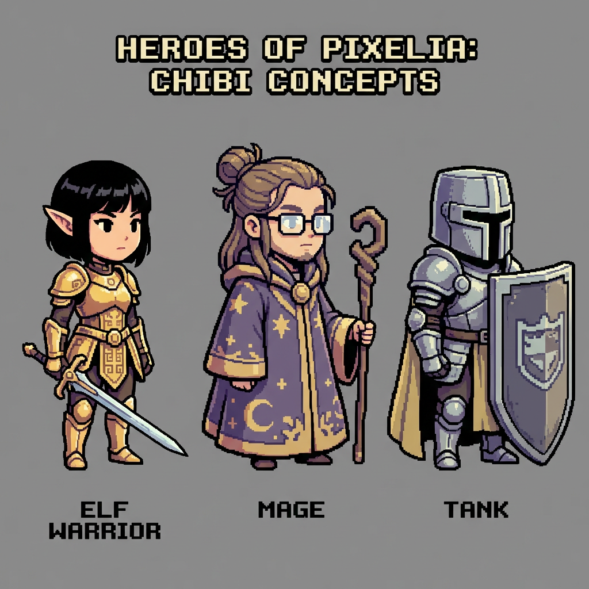

# Elemental Battle: Match-3 Combat Hybrid

## ⚔️ The Tale of the Three Heroes
In the deep, forgotten corridors of the Ancient Dungeon, a trio of heroes—the stalwart Fighter, the mystical Mage, and the unbreakable Tank—stands as the last line of defense against an endless tide of monsters. To survive, they must harness the power of the **Elemental Grid**. By shattering the very foundations of the grid, they trigger cascading reactions that empower their blades, shields, and spells. Will you guide them to victory, or will they be overwhelmed by the darkness?

---

## 🕹️ How to Play

### Shatter to Start
The game is played on a **7x7 grid**. Unlike traditional match-3 games where you swap pieces, here you directly interact with the **Bottom Row**.
- **Click (Shatter)** any block on the bottom row to destroy it.
- Blocks above will fall down (**Gravity**), and new blocks will refill the grid from the top.
- Falling blocks that create a line of 3 or more of the same type will **Match**.

### Cascades & Combos
Matching blocks triggers player actions. As blocks continue to fall and match, you create **Cascades**. These chain reactions are the key to overwhelming your foes!

---

## 📜 Rules of the Realm

### 💎 Elemental Blocks
Each block type corresponds to a specific action for your heroes:
- **Sword (Red):** Commands the Fighter to perform a physical strike on the nearest enemy.
- **Shield (Blue):** Adds to your party's Shield points, parrying incoming physical attacks.
- **Magic (Purple):** Empowers the Mage to strike the entire enemy party at once.
- **Heal (Green):** Restores your party's HP. If your HP is full, it grants bonus EXP!
- **Gem (Yellow):** Sharpens your skills, granting pure Experience Points (EXP).
- **Key (White):** Grants you a Key. Use it to open treasure chests found between waves.
- **Ska (Gray):** Junk blocks that cannot be matched. They must be cleared by **Shattering** them directly or via a **Blast** from an adjacent match.

### 🛡️ Combat Mechanics
- **Real-time Battle:** Enemies don't wait for your turn! They have their own attack timers.
- **Formation:** Enemies in the front (Vanguard) attack faster than those in the back.
- **Physical vs. Magic:** Shields are effective against physical strikes but offer no protection against enemy sorcery.
- **Treasure Chests:** After clearing a wave, you may find a chest. You can only carry one Key at a time, so use it or lose it!

---

## 💡 Pro Tips

- **Match Shields to block incoming physical attacks.**
- **"?" (Ska) blocks cannot be matched. Shatter or Blast them.**
- **Magic matches hit the entire enemy party.**
- **Shattering an item drops a "?" block from above.**
- **Shields cannot block enemy magic attacks.**
- **A Key is needed for chests, but you can only carry one.**
- **Shattering or Blasting a "?" drops an item from above.**
- **Match Gems to gain EXP.**
- **If stuck, focus on shattering "?" blocks to find new matches.**
- **Matching Heal blocks at full HP grants EXP.**
- **Matching Keys while holding one grants EXP.**
- **Enemies in the back row attack more slowly.**

---

*Developed for the AI Unity Hackathon.*
